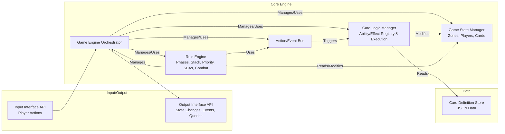

# Open Gathering

## 1. Project Overview

This project aims to build a robust, headless Magic: The Gathering (MTG) game engine using TypeScript. The primary goal is to create a core logic engine completely decoupled from any user interface, allowing it to run simulations, power different UIs (web, desktop, console), or serve as a backend for AI players.

### Core Principles:

- **Headless First**: All game logic resides in the engine, independent of presentation.
- **Data-Driven Card Definitions**: Card characteristics (name, cost, types, static text, P/T) are defined in external data files (JSON) for easy expansion.
- **Code-Mapped Card Logic**: Card abilities and effects are implemented as type-safe TypeScript modules/classes, referenced by keys in the card data. This balances flexibility with maintainability and type safety.
- **Event-Driven Architecture**: Interactions (especially triggers) are handled via a central event bus, promoting decoupling.
- **Scalability & Testability**: Designed with modules and clear interfaces to support adding new cards/rules and facilitate comprehensive testing.
- **Type Safety**: Leveraging TypeScript for robust development.
- **Initial Scope**: Standard 1v1 MTG play, focusing initially on core mechanics and a subset of cards/keywords. Multiplayer formats (Commander), niche rules (Bands With Other), and complex UI integrations are out of scope for the initial versions.

## 2. Architecture

The engine follows a modular architecture:



### Key Modules:

- **Game Engine Orchestrator**: The central coordinator. Receives actions, delegates to other modules, manages the main game loop.
- **Game State Manager**: Holds the canonical game state (players, life, mana, zones like Battlefield, Hand, Library, Graveyard, Stack, Exile). Manages CardInstance objects, each with a unique runtime ID and tracking its current state (tapped, counters, damage, controller, etc.). State changes should ideally be predictable and traceable (potentially using immutable patterns or clear mutation logs).
- **Rule Engine**: Enforces fundamental MTG rules:
  - Turn Structure (Phases/Steps)
  - Priority Handling
  - Stack Management (LIFO resolution of spells/abilities)
  - State-Based Actions (SBAs - checking for deaths, player loss, etc.)
  - Combat Logic
  - Continuous Effect Application (including Layers - implemented incrementally)
- **Action/Event Bus**: Decouples actions and consequences. Events (e.g., CreatureEntersBattlefield, CardDrawn) are emitted, and systems (like triggered abilities) subscribe and react.
- **Card Logic Manager**: Maps ability/effect keys from CardDefinition data to actual TypeScript implementations (IAbility, IEffect interfaces). It instantiates and attaches these logic handlers to CardInstance objects.
- **Card Definition Store**: Loads and provides access to static card data from JSON files.
- **Input Interface API**: Defines how external clients (UI, AI, test runner) submit player actions (e.g., castSpell, activateAbility, passPriority, declareAttackers). Includes validation.
- **Output Interface API**: Defines how the engine communicates back: emitting game state changes (full state or diffs), requesting player decisions (mulligans, targets, blocks), reporting errors, and providing state query methods.

## 3. Key Design Decisions & Implementation Strategy

### State Representation

The GameStateManager holds the complete state. Each CardInstance has a unique ID during the game. State changes should be clearly communicated via the Output API (initially perhaps full state snapshots on change, later potentially diffs for performance).

### Card Definitions (JSON)

See docs/card_schema.md (to be created) for the detailed JSON structure. Example snippet:

```json
{
  "id": "mtgjson_uuid_or_similar",
  "name": "Llanowar Elves",
  "manaCost": "{G}",
  "abilities": [
    {
      "key": "activated_ability_tap_add_mana",
      "parameters": { "mana": "{G}" }
    }
  ]
}
```

### Card Logic (TypeScript)

Abilities/Effects referenced by key in JSON are implemented as TypeScript classes adhering to specific interfaces (e.g., IActivatedAbility, ITriggeredAbility, IStaticAbility, IEffect).

A central AbilityRegistry (likely a Map<string, AbilityFactory>) maps keys like "activated_ability_tap_add_mana" to factory functions that create instances of the corresponding ability class (e.g., TapAddManaAbility).

This approach keeps the definition data-driven but the execution logic in maintainable, testable, type-safe code. See src/core/abilities/README.md (to be created) for interface definitions.

### Core Rules vs. Card Logic

Fundamental game rules (turn progression, stack operation, priority, SBAs) are hard-coded within the Rule Engine, not defined per-card. Card logic hooks into these systems via abilities and effects.

### Event Naming

Use clear, descriptive event names (e.g., EVENT_PHASE_CHANGED, EVENT_CREATURE_DIED, EVENT_SPELL_CAST). See src/core/events/README.md (to be created) for event definitions.

## 4. Directory Structure
> TBD

## 5. Testing Strategy

- **Unit Tests**: Each module and ability implementation should have focused unit tests verifying its logic in isolation.
- **Integration Tests**: Test the interaction between core modules (e.g., does casting a spell correctly use the stack, mana, and priority systems?).
- **Scenario/Interaction Tests**: Test specific card interactions and complex game states to ensure rules accuracy, especially edge cases. Use known rulings as a guide.
- **Test-Driven Development (TDD) / Behavior-Driven Development (BDD)**: Recommended where applicable, especially for rules and ability logic.
