# Implementation Process Documentation

This comprehensive guide documents the complete process for implementing Magic: The Gathering sets in the Open Gathering engine. It consolidates all frameworks, plans, and methodologies into a cohesive reference for future set implementations.

## Implementation Ecosystem Overview

The implementation process consists of interconnected components that work together to ensure high-quality, consistent set implementations.

### Core Components

```mermaid
graph TD
    A[Implementation Process] --> B[Planning]
    A --> C[Foundation]
    A --> D[Implementation]
    A --> E[Validation]
    A --> F[Optimization]
    A --> G[Documentation]
    
    B --> B1[Set Analysis]
    B --> B2[Implementation Roadmap]
    B --> B3[Risk Assessment]
    
    C --> C1[Card Frameworks]
    C --> C2[Core Mechanics]
    C --> C3[Testing Infrastructure]
    
    D --> D1[Card Implementation]
    D --> D2[Code Standards]
    D --> D3[Progress Tracking]
    
    E --> E1[Unit Testing]
    E --> E2[Integration Testing]
    E --> E3[Scenario Testing]
    E --> E4[Performance Testing]
    
    F --> F1[Code Refactoring]
    F --> F2[Performance Optimization]
    F --> F3[Technical Debt Reduction]
    
    G --> G1[Process Documentation]
    G --> G2[Knowledge Transfer]
    G --> G3[Continuous Improvement]
```


### Workflow Integration
The components work together in a continuous cycle:
1. **Plan**: Analyze set and create roadmap
2. **Build**: Implement cards using established frameworks
3. **Validate**: Test implementation thoroughly
4. **Optimize**: Refactor and improve code quality
5. **Document**: Capture knowledge and lessons learned
6. **Repeat**: Apply improvements to next set

## Step-by-Step Implementation Guide

### Phase 1: Planning and Preparation

#### 1. Set Analysis
Conduct comprehensive analysis of the target set.

**Activities:**
- Study official set documentation
- Identify all card mechanics
- Categorize cards by type and rarity
- Assess complexity of each card
- Identify new or modified mechanics

**Deliverables:**
- Set analysis report
- Card complexity matrix
- Mechanic dependency map
- Risk assessment

#### 2. Foundation Setup
Prepare the implementation environment.

**Activities:**
- Implement any missing core mechanics
- Update card implementation frameworks
- Add required test utilities
- Create data structure templates
- Update documentation with set-specific information

**Deliverables:**
- Updated engine with required mechanics
- Ready-to-use implementation templates
- Comprehensive test infrastructure

#### 3. Implementation Roadmap
Create a detailed implementation plan.

**Components:**
- **Timeline**: 8-week schedule with milestones
- **Resource Allocation**: Team assignments
- **Priority Order**: Implementation sequence
- **Risk Mitigation**: Contingency plans
- **Success Metrics**: Quality standards

**Example Roadmap:**
| Week | Focus | Deliverables |
|------|------|-------------|
| 1-2 | Foundation | Basic lands, simple creatures |
| 3-4 | Core Mechanics | Instants, sorceries, enchantments |
| 5-6 | Complex Cards | Rare cards, unique mechanics |
| 7-8 | Integration & Testing | Comprehensive testing, optimization |

### Phase 2: Card Implementation

#### 1. Implementation by Card Type

##### Basic Lands
```json
{
  "id": "basic_plains",
  "name": "Plains",
  "types": ["Land", "Plains"],
  "abilities": [
    {
      "key": "inherent_ability_tap_add_mana",
      "parameters": { "mana": "{W}" }
    }
  ]
}
```

**Implementation Steps:**
1. Create JSON definition
2. Verify ability key in registry
3. Implement unit tests
4. Validate in game

##### Creatures
```json
{
  "id": "grizzly_bears",
  "name": "Grizzly Bears",
  "manaCost": "{1}{G}",
  "cmc": 2,
  "types": ["Creature"],
  "subtypes": ["Bear"],
  "power": "2",
  "toughness": "2"
}
```

**Implementation Steps:**
1. Create JSON definition with power/toughness
2. Implement combat functionality
3. Add state-based actions (dying from damage)
4. Create unit and integration tests

##### Enchantments
```json
{
  "id": "crusade",
  "name": "Crusade",
  "manaCost": "{W}{W}",
  "cmc": 2,
  "types": ["Enchantment"],
  "oracleText": "White creatures get +1/+1.",
  "abilities": [
    {
      "key": "creatures_get_plus_one_plus_one",
      "parameters": { "power": 1, "toughness": 1 }
    }
  ]
}
```

**Implementation Steps:**
1. Create JSON definition with static ability
2. Implement continuous effect processing
3. Add targeting conditions (white creatures)
4. Create comprehensive tests

##### Instants and Sorceries
```json
{
  "id": "lightning_bolt",
  "name": "Lightning Bolt",
  "manaCost": "{R}",
  "cmc": 1,
  "types": ["Instant"],
  "oracleText": "Lightning Bolt deals 3 damage to any target.",
  "effects": [
    {
      "key": "deal_damage",
      "parameters": { "damage": 3 }
    }
  ]
}
```

**Implementation Steps:**
1. Create JSON definition with effect
2. Implement targeting system
3. Add spell resolution logic
4. Create tests for all target types

#### 2. Code Implementation Standards

##### TypeScript Best Practices
- Use strict typing throughout
- Implement proper interfaces
- Use enums for game states
- Avoid magic strings/numbers
- Use descriptive variable names

##### Class Structure
```typescript
class CardImplementation {
  // Properties
  private readonly id: string;
  private readonly parameters: any;
  
  // Constructor
  constructor(id: string, parameters: any) {
    this.id = id;
    this.parameters = parameters;
  }
  
  // Methods
  canActivate(gameState: IGameState): boolean {
    // Implementation
  }
  
  resolve(gameState: IGameState): IGameState {
    // Implementation
  }
}
```

##### Error Handling
```typescript
try {
  // Game action
  const newState = executeAction(gameState, action);
  return newState;
} catch (error) {
  // Convert to GameError with context
  throw new GameError(
    ErrorCode.ACTION_NOT_ALLOWED,
    'Action not allowed in current game state',
    'Check game phase and player priority',
    {
      currentPhase: gameState.phase,
      currentStep: gameState.step,
      activePlayer: gameState.activePlayerId
    }
  );
}
```

### Phase 3: Validation and Testing

#### 1. Testing Strategy

##### Unit Testing
Test individual components in isolation.

**Template:**
```typescript
describe('Card: [Card Name]', () => {
  let gameState: IGameState;
  let card: ICardInstance;
  
  beforeEach(() => {
    gameState = createTestGameState();
    card = createCardInZone('[card-id]', 'battlefield');
  });
  
  it('should [expected behavior]', () => {
    // Test implementation
    expect(result).toBe(expected);
  });
});
```

##### Integration Testing
Test card interactions.

**Template:**
```typescript
describe('Interaction: [Card A] + [Card B]', () => {
  let gameState: IGameState;
  
  beforeEach(() => {
    gameState = setupScenario('[scenario-id]');
  });
  
  it('should [expected interaction]', () => {
    // Test interaction
    expect(result).toBe(expected);
  });
});
```

##### Scenario Testing
Test realistic game situations.

**Template:**
```typescript
describe('Scenario: [Scenario Name]', () => {
  let gameState: IGameState;
  
  beforeEach(() => {
    gameState = setupScenario('[scenario-id]');
  });
  
  it('should play out as expected', () => {
    // Execute scenario
    gameState = playerAction(gameState, 'player1', 'cast', 'spell1');
    gameState = resolveStack(gameState);
    
    // Verify outcome
    expect(result).toBe(expected);
  });
});
```

#### 2. Quality Assurance

##### Code Review Checklist
Every implementation must pass:

**Design:**
- [ ] Uses appropriate design pattern
- [ ] Follows card implementation framework
- [ ] Minimizes code duplication
- [ ] Uses proper interfaces and types

**Functionality:**
- [ ] Correctly implements Oracle text
- [ ] Handles all edge cases
- [ ] Properly interacts with game state
- [ ] Follows MTG rules

**Performance:**
- [ ] Efficient state modifications
- [ ] No memory leaks
- [ ] Proper event handling
- [ ] Optimal algorithm complexity

**Testing:**
- [ ] 100% unit test coverage
- [ ] Integration tests for key interactions
- [ ] Edge case coverage
- [ ] Performance benchmarks

### Phase 4: Optimization and Refactoring

#### 1. Code Quality Improvements

##### Refactoring Process
1. **Assessment**: Analyze code quality
2. **Planning**: Prioritize refactoring tasks
3. **Implementation**: Execute refactoring
4. **Validation**: Test refactored code

##### Common Refactoring Patterns
- **Extract Method**: Break down complex methods
- **Replace Conditional with Polymorphism**: Use classes instead of conditionals
- **Introduce Parameter Object**: Group related parameters
- **Preserve Whole Object**: Pass objects instead of individual properties
- **Replace Type Code with Class**: Use classes for type codes

#### 2. Performance Optimization

##### Critical Paths
- Game state modifications
- Event processing
- Card lookup
- Ability resolution
- SBA checking

##### Optimization Techniques
- **Memoization**: Cache expensive calculations
- **Lazy Evaluation**: Delay computation until needed
- **Object Pooling**: Reuse frequently created objects
- **Batch Processing**: Process multiple items together
- **Algorithm Optimization**: Use more efficient algorithms

### Phase 5: Documentation and Knowledge Transfer

#### 1. Documentation Standards

##### Code Documentation
- JSDoc for all public methods
- Implementation notes for complex logic
- Examples for usage patterns
- Performance characteristics

##### Process Documentation
- Implementation decisions
- Lessons learned
- Best practices
- Troubleshooting guide

#### 2. Knowledge Transfer

##### Team Practices
- Regular code reviews
- Pair programming
- Knowledge sharing sessions
- Documentation updates

##### Onboarding
- Comprehensive documentation
- Example implementations
- Testing guidelines
- Troubleshooting guide

## Best Practices and Patterns

### 1. Design Patterns

#### Strategy Pattern
Use for different ability types:
```typescript
interface IAbility {
  canActivate(gameState: IGameState): boolean;
  resolve(gameState: IGameState): IGameState;
}

class TapAddManaAbility implements IAbility {
  // Implementation
}

class DealDamageAbility implements IAbility {
  // Implementation
}
```

#### Observer Pattern
Use for event system:
```typescript
class EventBus {
  private subscribers: Map<string, Function[]>;
  
  subscribe(eventType: string, callback: Function): void {
    // Implementation
  }
  
  emit(event: GameEvent, gameState: IGameState): void {
    // Implementation
  }
}
```

#### Factory Pattern
Use for card creation:
```typescript
class CardFactory {
  createCard(cardId: string, ownerId: string): ICardInstance {
    // Implementation
  }
}
```

### 2. Testing Patterns

#### Test Data Builders
Create reusable test data:
```typescript
class GameStateBuilder {
  private gameState: IGameState;
  
  withPlayerLife(playerId: string, life: number): this {
    // Implementation
  }
  
  withCardInZone(cardId: string, zone: string): this {
    // Implementation
  }
  
  build(): IGameState {
    // Implementation
  }
}
```

#### Test Fixtures
Create reusable test scenarios:
```typescript
const combatScenario = {
  player1: {
    life: 20,
    hand: ['lightning_bolt'],
    battlefield: ['grizzly_bears']
  },
  player2: {
    life: 20,
    hand: [],
    battlefield: ['serra_angel']
  }
};
```

### 3. Performance Patterns

#### Immutable Data Structures
Use for game state:
```typescript
function updateGameState(
  currentState: IGameState, 
  updates: Partial<IGameState>
): IGameState {
  return {
    ...currentState,
    ...updates
  };
}
```

#### Structural Sharing
Optimize state cloning:
```typescript
class GameState {
  clone(): IGameState {
    return Object.assign(Object.create(Object.getPrototypeOf(this)), this);
  }
}
```

## Troubleshooting Guide

### 1. Common Issues

#### Card Not Working
**Symptoms:**
- Card doesn't appear in hand
- Ability can't be activated
- Effect doesn't resolve

**Solutions:**
1. Verify card ID in deck definition
2. Check ability key in registry
3. Validate JSON structure
4. Review implementation code
5. Check game state conditions

#### Ability Not Triggering
**Symptoms:**
- Triggered ability doesn't activate
- Static ability not applying

**Solutions:**
1. Verify event subscription
2. Check trigger conditions
3. Validate game state
4. Review ability implementation
5. Check for conflicting effects

#### Performance Issues
**Symptoms:**
- Slow game actions
- High memory usage
- UI lag

**Solutions:**
1. Profile critical paths
2. Optimize state modifications
3. Reduce event frequency
4. Implement batching
5. Check for memory leaks

### 2. Debugging Process

#### Step 1: Reproduce the Issue
- Create minimal test case
- Document steps to reproduce
- Verify consistent reproduction

#### Step 2: Isolate the Problem
- Check game state
- Verify card implementation
- Review related code
- Identify potential causes

#### Step 3: Fix and Test
- Implement fix
- Create regression test
- Verify fix works
- Check for side effects

#### Step 4: Document the Solution
- Update documentation
- Add to troubleshooting guide
- Share with team
- Prevent recurrence

## Future Development Roadmap

### 1. Short-Term Goals (0-3 months)
- Implement Beta set
- Add multiplayer support
- Improve UI integration
- Enhance testing infrastructure
- Optimize performance

### 2. Medium-Term Goals (3-6 months)
- Implement Unlimited set
- Add AI player
- Support for additional formats
- Enhanced analytics
- Improved error handling

### 3. Long-Term Goals (6-12 months)
- Full MTG card database
- Tournament support
- Advanced AI
- Mobile integration
- Community contributions

## Success Metrics

The implementation process is successful when:

### Quality
- [ ] 100% of cards implemented correctly
- [ ] Zero critical bugs
- [ ] 100% test coverage
- [ ] Code quality score > 90%
- [ ] Performance within targets

### Efficiency
- [ ] Implementation on schedule
- [ ] Resource utilization optimized
- [ ] Team productivity high
- [ ] Knowledge transfer effective
- [ ] Continuous improvement

### Sustainability
- [ ] Low technical debt
- [ ] High maintainability
- [ ] Good documentation
- [ ] Effective knowledge sharing
- [ ] Scalable process

This comprehensive implementation process documentation provides a complete guide for consistently implementing MTG sets in the Open Gathering engine. By following this process, teams can deliver high-quality, reliable implementations that accurately reflect the game's rules and provide an excellent user experience.